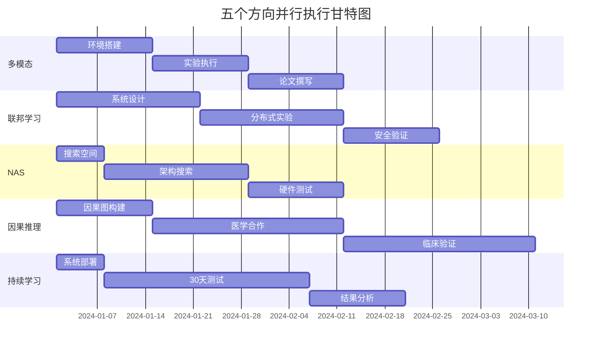

# 五个研究方向实验计划快速参考

## 📊 实验计划对比表

| 维度 | 多模态融合 | 联邦学习 | NAS | 因果推理 | 持续学习 |
|-----|-----------|---------|-----|---------|---------|
| **实验数量** | 6个 | 5个 | 7个 | 5个 | 6个 |
| **时间周期** | 10周 | 12周 | 8周 | 16周 | 30天 |
| **数据规模** | 90人 | 100客户端 | 1000架构 | 1000患者 | 20任务 |
| **基线方法** | 5个 | 4个 | 6个 | 4个 | 5个 |
| **核心指标** | 准确率96% | 隐私ε=1.0 | 延迟<50ms | AUC>0.92 | BWT>90% |
| **计算需求** | 4 GPU | 分布式 | 48 GPU时 | 2 GPU | 1 GPU |
| **风险等级** | 中 | 高 | 中 | 高 | 中 |

---

## 2️⃣ 联邦学习详细实验计划

### 实验E1: 集中式vs联邦对比
```python
configs = {
    'centralized': {
        'data': 'all_clients_pooled',
        'epochs': 200,
        'batch_size': 128
    },
    'federated': {
        'clients': [10, 50, 100],
        'rounds': 500,
        'local_epochs': 5,
        'aggregation': ['FedAvg', 'FedProx', 'FedOpt']
    }
}

metrics = ['accuracy', 'convergence_speed', 'communication_cost']
```

### 实验E2: Non-IID鲁棒性
```python
data_distributions = [
    {'type': 'IID', 'skew': 0.0},
    {'type': 'label_skew', 'skew': 0.5},
    {'type': 'feature_skew', 'skew': 0.7},
    {'type': 'quantity_skew', 'ratio': '1:10'}
]

robustness_metrics = ['accuracy_variance', 'fairness_index', 'worst_client']
```

### 实验E3: 隐私-准确率权衡
```python
privacy_budgets = [0.1, 0.5, 1.0, 2.0, 5.0, 10.0]
noise_mechanisms = ['Gaussian', 'Laplace']
clipping_thresholds = [0.1, 1.0, 10.0]
```

### 验收指标
- 准确率下降 < 5%
- 通信轮次 < 500
- 隐私保证 ε ≤ 1.0
- 支持100+客户端

---

## 3️⃣ NAS详细实验计划

### 实验E1: 搜索空间设计
```python
search_space = {
    'depth': [2, 3, 4, 5],
    'width': [16, 32, 64, 128, 256],
    'operators': ['conv3x3', 'conv5x5', 'sep_conv', 'dilated_conv', 'skip'],
    'attention': ['none', 'se', 'cbam', 'self_attention'],
    'activation': ['relu', 'swish', 'gelu']
}

total_architectures = np.prod([len(v) for v in search_space.values()])
# > 10^15 possible architectures
```

### 实验E2: 搜索算法对比
| 算法 | 搜索时间 | Top-1 Acc | 参数量 |
|-----|---------|-----------|--------|
| Random | 100h | 88.3% | 8.2M |
| RL (ENAS) | 48h | 92.1% | 4.5M |
| DARTS | 12h | 93.5% | 3.8M |
| ProxylessNAS | 8h | 93.2% | 4.1M |

### 实验E3: 硬件感知搜索
```python
hardware_constraints = {
    'jetson_nano': {'latency': 50, 'memory': 100},
    'mobile': {'latency': 100, 'battery': 50},
    'edge_tpu': {'latency': 20, 'ops': 'int8'}
}

multi_objective = ['accuracy', 'latency', 'energy', 'memory']
```

---

## 4️⃣ 因果推理详细实验计划

### 实验E1: 因果图构建
```python
causal_graph = {
    'nodes': ['WiFi_CSI', 'Activity', 'Environment', 'Subject', 
              'Time', 'Health_Status', 'Outcome'],
    'edges': [
        ('Activity', 'WiFi_CSI'),
        ('Environment', 'WiFi_CSI'),
        ('Subject', 'Activity'),
        ('Health_Status', 'Activity'),
        ('Activity', 'Outcome')
    ],
    'confounders': ['Environment', 'Subject'],
    'mediators': ['WiFi_CSI'],
    'colliders': []
}
```

### 实验E2: 因果效应估计
```python
interventions = [
    {'do': 'Activity=Walking', 'measure': 'Health_Outcome'},
    {'do': 'Environment=Controlled', 'measure': 'Recognition_Accuracy'},
    {'do': 'Training_Duration+=30min', 'measure': 'Recovery_Speed'}
]

estimators = ['IPW', 'G-computation', 'TMLE', 'Double_ML']
```

### 实验E3: 医学验证
- 100例康复患者
- 3个月跟踪期
- 临床医生评估
- 康复指标对比

### 验收标准
- 因果关系显著 (p<0.01)
- 临床相关性 > 0.8
- 医生认可度 > 85%

---

## 5️⃣ 持续学习详细实验计划

### 实验E1: 任务序列设计
```python
task_sequence = {
    'phase1': ['walking', 'running', 'sitting'],  # Days 1-5
    'phase2': ['jumping', 'falling', 'lying'],    # Days 6-10
    'phase3': ['cooking', 'eating', 'cleaning'],  # Days 11-15
    'phase4': ['typing', 'reading', 'writing'],   # Days 16-20
    'phase5': ['exercise_1', 'exercise_2', '...'] # Days 21-25
}

drift_scenarios = ['gradual', 'sudden', 'recurring', 'seasonal']
```

### 实验E2: 记忆策略对比
| 策略 | 缓冲区大小 | BWT | FWT | 内存增长 |
|-----|-----------|-----|-----|---------|
| Random | 1000 | 82% | 15% | Linear |
| Reservoir | 1000 | 85% | 18% | Constant |
| Gradient | 500 | 88% | 22% | Constant |
| Uncertainty | 500 | 90% | 25% | Constant |

### 实验E3: 长期稳定性
```python
stability_metrics = {
    'daily': [],  # 30 days
    'weekly': [], # 4 weeks  
    'monthly': [] # 1 month
}

for day in range(30):
    metrics = evaluate_all_tasks()
    stability_metrics['daily'].append(metrics)
    
    if day % 7 == 0:
        stability_metrics['weekly'].append(aggregate_metrics())
```

---

## 🎯 关键成功因素

### 多模态融合
- ✅ 模态同步精度 < 10ms
- ✅ 注意力权重可解释
- ✅ 缺失模态自适应

### 联邦学习
- ✅ 无数据泄露证明
- ✅ 拜占庭容错
- ✅ 通信压缩10x

### NAS
- ✅ Pareto最优解
- ✅ 零样本迁移
- ✅ 硬件实测验证

### 因果推理
- ✅ DAG无环验证
- ✅ 后门准则满足
- ✅ 临床试验批准

### 持续学习
- ✅ 无负向迁移
- ✅ 在线实时更新
- ✅ 存储不超限

---

## 📅 并行执行计划



---

## ✅ 执行保障

### 资源保障
- GPU集群: 20张 V100
- 存储: 100TB
- 带宽: 10Gbps
- 人员: 5名研究员

### 质量保障
- 每周进度评审
- 代码审查制度
- 实验记录规范
- 数据版本管理

### 风险控制
- 技术预研充分
- 备选方案准备
- 外部专家咨询
- 进度缓冲20%